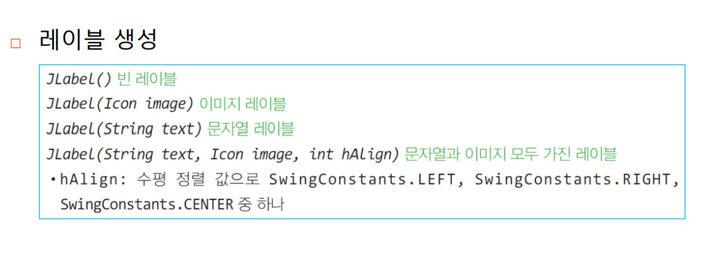
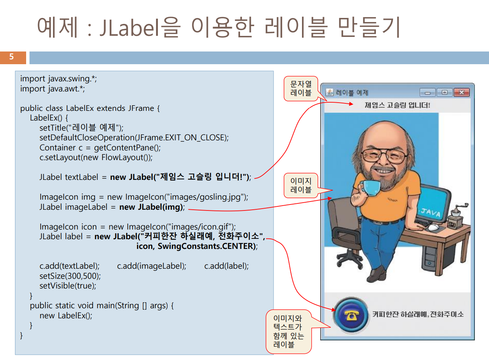

# JAVA-1127_GUI2

## 지난시간 

### swing

보더-5개(창 크기의 맞춰 알아서 변함)


## 배치 관리자 이어서 ..

## GridLayout 

배치 방법 공간을 동일한 사각형 격자로 분할 하고 각 셀에 컴포넌트 하나씩 배치

생성자에 행수, 열수 지정

셀에서 왼쪽에서 오른쪽으로 다시 위에서 아래로 순서대로 배치

```java
container.setLayout(new GridLayout(4,3,5,5)); // 4×3 분할로 컴포넌트 배치 container.add(new JButton("1")); // 상단 왼쪽 첫 번째 셀에 버튼 배치 container.add(new JButton("2")); // 그 옆 셀에 버튼 배치
```

### 생성자

-  GridLayout() 
-  GridLayout(int rows, int cols) 
-  GridLayout(int rows, int cols, int hGap, int vGap) 
  -  rows : 격자의 행수 (디폴트 : 1) 
  -  cols : 격자의 열수 (디폴트 : 1) 
  -  hGap : 좌우 두 컴포넌트 사이의 수평 간격, 픽셀 단위(디폴트 : 0) 
  -  vGap : 상하 두 컴포넌트 사이의 수직 간격, 픽셀 단위(디폴트 : 0) 
  -  rows x cols 만큼의 셀을 가진 격자로 컨테이너 공간을 분할, 배치

여러 화면을 슬라이드처럼 보여주는 레이아웃

생성자

​	  CardLayout() 

​	 CardLayout(int hgap, int vgap) 

-  주요함수 
  -  add(Container parent, String name) 
    -  panel.add(card1, “1”); 
    - panel.add(card2, “2”); 
  - next(Container parent) 
    -  현재 보여주고 있는 컴포넌트 다음 것을 보여줌  
  - previous(Container parent) 
    -  현재 보여주고 있는 것 이전에 추가된 것을 보여줌  
  - show(Container parent, String name) 
    - 컨테이너 이름을 보여줌 ➔ card.show(panel, “1”);

## 배치 관리자 없는 컨테이너

- 배치 관리자가 없는 컨테이너가 필요한 경우
  - 응용 프로그램에서 직접 컴포넌트의 크기와 위치를 결정하고자 하는 경우
    1. 컴포넌틔의 크기나 위치를 개발자 임의로 결정하고자 하는 경우
    2. 게임 프로그램과 같이 시간이나 마우스/키보드의 입력에 따라 컴포넌트들의 위치와 크기가 수시로 변하는 경우
    3.  여러 컴포넌트들이 서로 겹쳐 출력하고자 하는 경우
- 컨터이너의 배치 관리자 제거 방법

 container.setLayout(null);

- 컨테이너의 배치 관리자가 없어지면 컴포넌트에 대한 어떤 배치도 없음
  - 추가된 컴포넌트의 크기가 0으로 설정, 위치는 예측할수 없게 됨
- 배치 관리자가 없는 컨테이너에 컴포넌트를삽입할 떄 
  - 프로그램에서 컴포넌트의 절대 크기와 위치 설정
  - 컴포넌트들이 서로 겹치게 할 수 있음
- 컴포넌트의 크기와 위치 설정 메소드
  - void setSize(int width, int height)
  - void setLocation(int x,int y)
  - void setBounds(int x ,int y, int width,int height)// 
  - 


```java
import javax.swing.*; import java.awt.*;
public class NullContainerEx extends JFrame { 
    NullContainerEx() { 
        setTitle("배치관리자 없이 절대 위치에 배치하는 예제");
        setDefaultCloseOperation(JFrame.EXIT_ON_CLOSE); 
        Container contentPane = getContentPane(); 
        contentPane.setLayout(null); // 컨텐트패인의 배치관리자 제거
        JLabel la = new JLabel("Hello, Press Buttons!"); 
        la.setLocation(130, 50); //la를 (130,50) 위치로 지정 la.setSize(200, 20); // la를 200x20 크기로 지정 
        contentPane.add(la); // la를 컨텐트패인에 부착
    // 9개의 버튼 컴포넌트를 생성하고 동일한 크기로 설정한다. 
        // 위치는 서로 겹치게 설정한다. 
        for(int i=1; i<=9; i++) { 
            JButton b = new JButton(Integer.toString(i)); // 버튼 생성 
            b.setLocation(i*15, i*15); // 버튼의 위치 설정 
            b.setSize(50, 20); // 버튼의 크기는 동일하게 50x20 
            contentPane.add(b); // 버튼을 컨텐트패인에 부착 } 
            setSize(300, 200); setVisible(true);
}
        public static void main(String[] args) {
            new NullContainerEx(); 
        }
}
```


## JLabel

- ### jlabel의 용도

  - 문자열이나 이미지를 화면에 출력하기 위한 목적

- 레이블 생성

- 



- 이미지 버튼 만들기
  - 하나의 버튼에 3개의 이미지 등록
  - 마우스 조작에 따라 3개의 이미지 중 적절한 이미지 자동 출력
- 3개의 버튼 이미지
  - normallcon
    - 버튼의 보통상태 출력 이미지
    -  생성자에 이미지 아이콘 전달 혹은 JButton의 setIcon(normalIcon);  
  -   rolloverIcon 
    -  버튼에 마우스가 올라갈 때 출력되는 이미지 
    -  이미지 설정 메소드 : JButton의 setRolloverIcon(rolloverIcon);  
  -  pressedIcon 
    -  버튼을 누른 상태 때 출력되는 이미지 
    - 이미지 설정 메소드 : JButton의 setPressedIcon(pressedIcon) 

```java
import javax.swing.*;
import java.awt.*;
public class ButtonImageEx extends JFrame {
    ButtonImageEx() {
        setTitle("이미지 버튼 예제");
        setDefaultCloseOperation(JFrame.EXIT_ON_CLOSE);
        Container c = getContentPane();
        c.setLayout(new FlowLayout());
        ImageIcon normalIcon = new ImageIcon("images/normalIcon.gif");
        ImageIcon rolloverIcon = new ImageIcon("images/rolloverIcon.gif");
        ImageIcon pressedIcon = new ImageIcon("images/pressedIcon.gif");
        JButton btn = new JButton("call~~", normalIcon);
        btn.setPressedIcon(pressedIcon); // pressedIcon용 이미지 등록
        btn.setRolloverIcon(rolloverIcon); // rolloverIcon용 이미지 등록
        c.add(btn);
        setSize(250,150);
        setVisible(true);
	}
	public static void main(String [] args) {
		new ButtonImageEx();
	}
}

```

