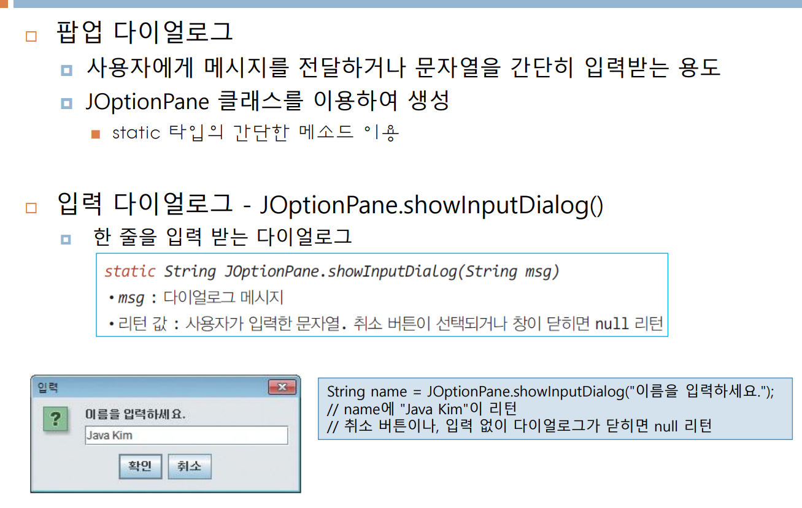
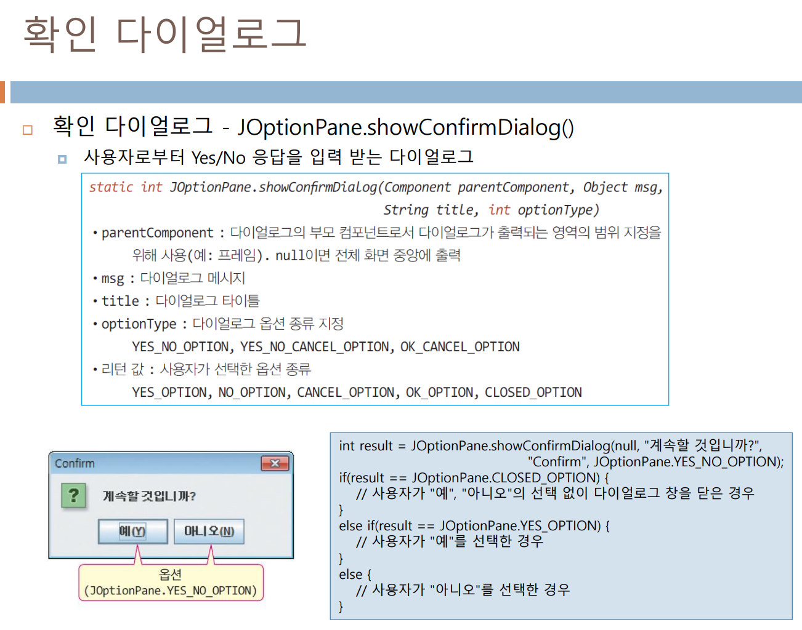
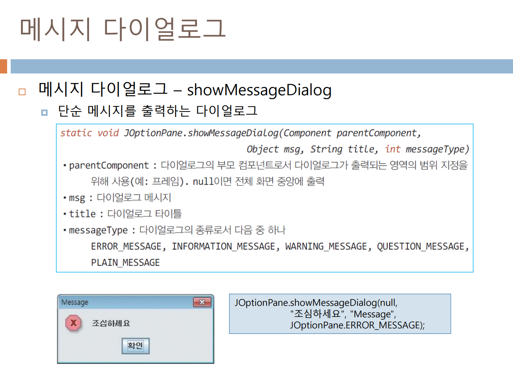
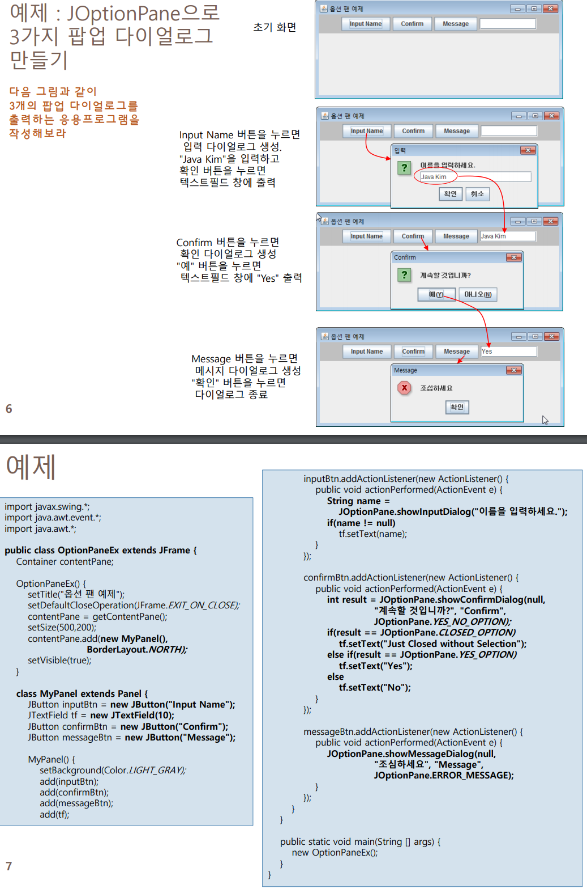
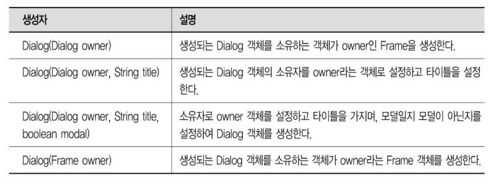

# java_1209 dialog

## 팝업 다이얼로그, JOptionPane

## 확인 다이얼로그

## 메시지 다이얼로그 -showMessageDialog

## 대화상자

- Dialog 클래스
  - 메인 윈도우 외에 메시지를 출력하거나, 사용자로부터 데이터를 입력 받을떄 주로 사용하는 컨테이너이다.
  - 보통은 Dialog 클래스로 부터 상속을 받아 새로운 기능을 가진 대화상자를 만드는데 사용된다.
- Dialog 클래스의 생성자

### 윈도우api와 같은 모달 , 모달리스

다이얼로그 클래스에 부모객체를 가지고 있는 것이 좋다.

