# 컴퓨터 구조 기말 정리

# CA-07

## 명령어 파이프라이닝

- 하나의 명령가 실행되는 도중에 다른 명령어 실행을 시작하는 기법

### 2-단계  명령어 파이프라인

- #### 인출단계

- #### 실행 단계

두단계들에 동일한 클록을 가하여 동작시간을 일치시킴

문제점 두단계의 처리시간이 동일하지 않으면 두 배의 속도향상을 얻지 못함

### 4-단계  명령어 파이프라인

- #### 명령어 인출 IF Instruction Fetch

- #### 명령어 해독 ID  Instruction Decode

- #### 오퍼랜드 인출 OF Operand Fetch

- #### 실행 EX Execute

### 6- 단계  명령어 파이프라인

- #### 명령어 인출 IF Instruction Fetch

- #### 명령어 해독 ID  Instruction Decode

- ### 오퍼랜드 계산 -OC Operand Calculation

- #### 오퍼랜드 인출 OF Operand Fetch

- #### 실행 EX Execute

- ### 오퍼랜드 저장 -OW Operand Writing

### 파이프라인에 의한 명령어 실행시간

- 파이프라인 단계수 k
- 실행할 명령어 ㄷ들의수 N
- 각 파이프라인의 단계가 한 클록 주기 씩걸린다 가정

#### 파이프 라인에 의한 전체 명령어 실행시간 T= k+(N-1)

#### 파이프라인을 적용하지 않았을 경우 k x N

#### 파이프라인에 의한 속도향상

#### Sp = ( K x N) / (k + (N -1) )

### 파이프라이닝 효과가 100퍼센트 만족될수 없는 이유

- 모든 명령어 파이프라인 단계들을 거치지 않음
  - -경우에 따라서는 어떤 명령어들은 오퍼랜드를 인출할 필요가 없다.
  - 파이프 라인의 단순화를 위해서는 모든 명령어가 단계를 모두 통과
- 파이프라인의 클록처리는 가장 처리시간이 오래걸리는 단계를 기준으로 결정된다.
- 4단계 파이프라이닝에서 IF단계와 OF단계가 동시에 기억장치를 액세스 하는경우 액세스 충돌이 일어난다.
- 조건 분기 명령어가 실행되면, 미리 인출하여 처리하던 명령어들이 무효가 된다.

## 슈퍼 스칼라 프로세스

- ### 수의 연산 적재 저장 그리고 조건 분기등의 보편적인 명령어들을 동시에 시작시키고 독립적으로 실행하는 개념

- #### 다수의 명령어 파이프 라인을 이용 서로 다른 명령어 독립적으로 실행

- #### 매 클록 주기마다 각 명령어 파이프라인이 별도의 명령어를 인출하여 동시에 실행

- #### 파이프라인 수  만큼 처리 속도는 향상하나 병렬처리 명령어 파이프라인 설계 복잡

### 슈퍼 스칼라에 의한 속도 향상

#### 파이프라인 단계 k,명령어 갯수N

#### 단일 파이프라인 프로세서 실행시간  P=k+N-1

#### m개의 기능 유닛을 가진 슈퍼스칼라 프로세서에서 실행시간 ss=k+N/m-1

#### 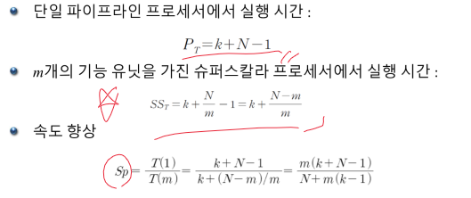

### 슈퍼 스칼라의 속도 저하요인 

- 명령어들 간의 데이터의존관계
- 하드웨어(ALU,레지스터 ,등) 이용에 대한 경합발생
  - ->동시 실행 가능한 명령어 수<m
- 해결책
  - 명령어들간의 데이터 의존성 제거를 위해 명령어 실행 순서 재배치
  - 기억장치,레지스터 경합을 방지하기위해 하드웨어 추가중복 설치

## 듀얼-코어 및 멀티 코어

- #### CPU 코어 -명령어 실행에 필요한 냅부의 핵심 하드웨어 모듈- 슈퍼스칼라모듈,ALU및 레지스터 세트

- #### 멀티 코어 프로세서

  - 여러개의 CPU코어 들을 하나의 치벵 포함시킨 프로세서
  - 듀얼 코어(dual-core) 두 개의 CPU 코어 포함
  - 쿼드 코어(quad-core) 네 개의 CPU 코어 포함

- #### 칩 레벨 다중프로세서 OR 단일 칩 다중 프로세서

- #### 각 CPU코어는 별도의 H/W모듈로 이루어지며 , 시스템 버스와 캐시만 공유

  - 프로그램 실행에 있어서 각 코어는(슈퍼 스칼라의 각 파이프 라인보다) 더 높은 독립성 가짐
  - 멀티 -태스킹 혹은 멀티스레딩

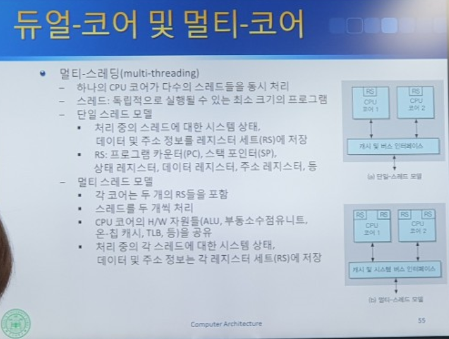

# CA-08 마이크로 연산과 제어장치

## 제어장치의 개념

### 제어장치를 구현하는 방법

- #### 하드 와이어드 제어방식

  - 논리회로인 논리 게이트와 플립플롭으로 제어장치를 설계한 것
  - 마이크로 연산을 빠르게 수행할수는 있으나, 속도적인 장점에도 불구 융통성이 없음

- #### 마이크로 프로그래밍 기법

  - 마이크로 프로그램 제어를 사용하는 방법
  - 제어 함수나 제어 단어와 같은 제어 정보를 특별한 기억장치에 0과 1로 기억시킨 구조
  - 기억장치의 내용을 변경할 수 있어 융통성이 좋음

## 제어 장치의 기능

- 명령어 코드의 해독
- 명령어 실행에필요한 제어신호들의 발생 
  - 명령어 사이클 = 인출사이클+실행사이클+인터럽트 사이클
  - 각  부 사이클ㄹ은 여러개의 마이크로 연산들로 구성

- #### 마이크로 명령어

  - 각 주기에서 수행되는 마이크로 연산을 2진 비트들로 표현한 것
  - 제어 단어

- #### 마이크로 프로그램

  - 일련의 마이크로 명령어들의 집합
  - 마이크로 명령어들로 구성된 프로그램

- #### 루틴

- 마이크로 명령어는 인출과 같은 cpu의 특정 기능을 수행하기 위하여 그룹 단위로 작성

- 하나의 기능을 수행하는 마이크로 명령어들의 그룹

- 인출 사이클 루틴 간접 사이클 루틴,실행사이클루틴,인터럽트 사이클루틴

## 제어 장치의 구조

- ### 마이크로 프로그래밍 기법에 의한 제어장치의 구조

- ### 명령어 해독기(instruction decoder)

  - 명령어 레지스터로 부터 들어오는 명령어의 연산코드를 해독하여 해당연산을 수행하기 위한 루틴의 시작주소를 결정

- ### 제어 기억 장치

  - 마이크로 명령어들로 이루어진 마이크로 프로그램을 저장하는 내부 기억 장치

- ### 제어 주소 레지스터 ->CAR

  - 다음에 실행할 마이크로 명령어의 주소를 저장하는 레지스터
    - ->제어 기억장치의 특정 위치를 지칭

- ### 제어 버퍼 레지스터 -> CBR

  - 제어 기억장치로부터 읽혀진 마이크로 명령어 비트들을 일시적으로 저장하는 레지스터

- ### 서브루틴 레지스터 ->SBR

  - 마이크로 프로그램에서 서브루틴이 호출되는 경우 현재의 CAR내용을 일시적으로 저장하는 레지스터

- ### 순서 제어 모듈

  - 마이크로 명령어의 실행순서를 결정하는 회로들의 집합

## 제어 유니트의 내부 구성도

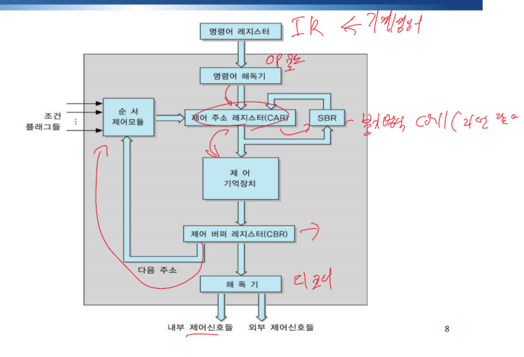

## CPU의 명령어 세트 설계과정

- #### 명령어들의 종류와 비트 패턴 정의

- 명령어들의 실행에 필요한 하드웨어 설계

- 각 명령어를 위한 실행 사이클 루틴을 마이크로 프로그래밍

  - 프로그래밍화-> 루틴들의 집합이므로 CPU설계 단계에서 확정
  - 변하지 않음 ROM으로 구성되어 CPU칩 내에 포함

- 마이크로 프로그램 코드들을 제어 기억장치에 저장

  - 루틴들의 길이와 제어기억장치에 저장되는 위치는 CPU마다 다름

## 제어 기억장치의 내부 구성

#### 마이크로 프로그램 루틴을 제어기억 장치에 저장한 예

- ##### 제어 기억장치 =128단어

- ##### 전반부 =64단어 

  - 공통 루틴들 저장
  - 인출, 간접 및 인터럽트 사이클

- ##### 후반부

  - 각 명령어의 실행 사이클 루틴들 저장

- ##### 단어의 길이 -마이크로 명령어 형식에 의해 결정

## 명령어 해독

- ### 명령어 해독기

  - 명령어 레지스터로 적재된 명령어 비트 중에서 연산 코드 부분만 제어장치의 해독기로 전달
  - 명령어의 연산 코드가 지정하는 연산을 실행하기위해 필요한 실행 사이클 투틴의 시작주소를 결정하는 동작 ="명령어를 해독한다"

- ### 사상을 이용한 해독 방법

  - 명령어의 연산코드를 특정  비트패턴과 조합하는 방법
  - 16비터길이의 명령어                                   \
  - 연산 코드: LOAD 0001이라면 
    - 실행 사이클 루틴의 시작주소 1000100(64+4 68번지)
    - CAR로 입력
    - 명령어 사이클이 시작되면 그 위치 로부터 마이크로 명령어들이 순차적으로 인출
    - ​                                                                                                                                                                                                                                                                                                                                                                                                                                                                                                                                                                                                                                                                                                                                                                                                                                                                                                                                                                                                                                                                                                                                                                                                                                                                                                                                                                                                                                                                                                                                                                                                                                                                                                                                                                                                                                                                                                                                                                                                                                                                                                                                                                                                                                                                                                                                                                                                                                  

## 마이크로 명령어 형식

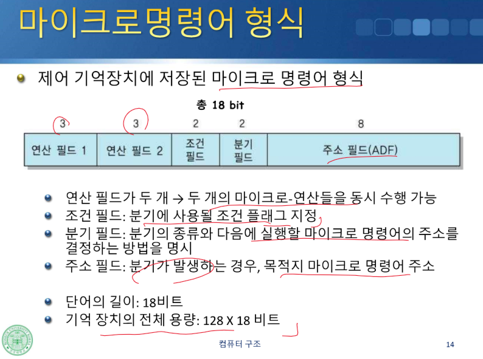

- 연산 필드가 두 개-> 두 개의 마이크로 연산들을 동시 수행 가능
- 조건 필드 : 분기에 사용될 조건 플래그 지정
- 분기 필드 : 분기의 종류와 다음에 실행될 마이크로 명령어의 주소를 결정하는 방법을 명시
- 주소 필드 : 분기가 발생하는 경우,  목적지 마이크로 명령어 주소
- 단어의 길이 18비트 
- 기억장치의 저넻 용량 128X18비트

## 조건 필드의 코드 지정

#### 두 비트로 구성되며 분기의 조건으로 사용

- ##### U  무조건 분기

  - ##### 분기될 목적 주소는 주소필드의 값

  - ##### 주소 필드의 값이 CAR로 적재

- ##### I 만약 I==1ㅇ면 간접 사이클 루틴 호출

- ##### S저장된 데이터의 부호가 1이면 분기

- ##### Z 누산기에 저장된 데이터가 0이면 모두 0비트이면 분기 - 조건 플랫그 z값에 의해

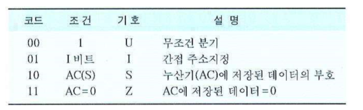

## 분기 필드의 코드 지정

#### 두 비트로 구성되며, 분기 동작을 지정

- 조건 필드의 조건이 만족되면 주소 필드의 내용을 CAR로 적재 -> 그 주소로 분기 JUMP or CALL
  - -조건이 만족 되지 않으면 CAR =CAR+1
- RET : 서브루틴으로부터 복귀 ( CAR =SBR)
- MAP :사상 방식에 의하여 분기 목적지 주소 결정

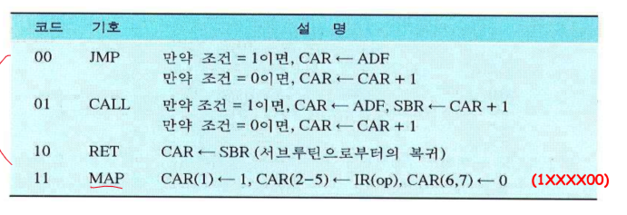

## 인출 사이클 루틴

맨처음에 

1. ##### PCTAR				U	JMP NEXT   ; MAR  <- PC 

2. ##### READ,INCPC	U	JMP NEXT    ; BR <-M[MAR], PC= PC+1  ---->여기서 BR이 무슨 BR??

3. ##### BRTIR				U MAP 			  ; IR <- MBR 해당 실행사이클 루틴으로 분기

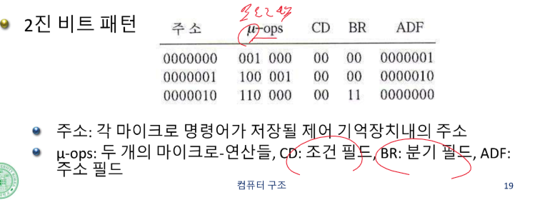

## 간접 사이클 루틴

- #### 간접 주소지정 방식 사용하는 경우 유효주소 계산

- #### 일반적으로 인출 사이클 루틴의 다음 위치에 저장

1. ##### IRTAR			U 	JMP	NEXT  		;MAR <- IR(addr)
2. ##### READ            U    JMP     NEXT          ;MBR <- M[MAR]
3. ##### BRTIR          U    RET                        ; IR(addr)<=MBR

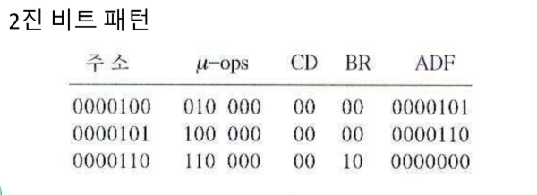

### 각 명령어에 대한 실행 사이클 루틴들

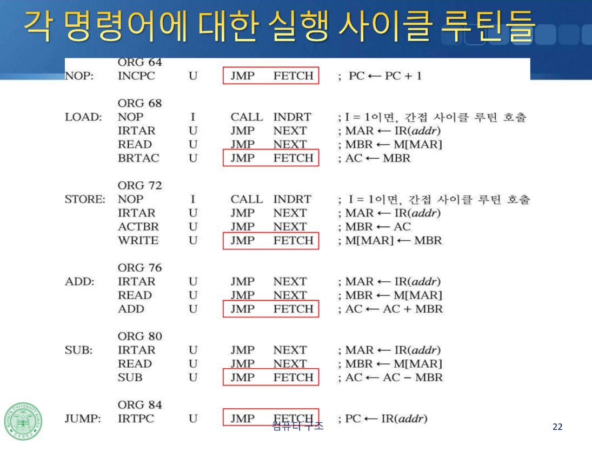

## 마이크로 프로그램의 순서 제어

- 제어 장치의 명령어 실행 제어

  - 제어 기억장치에서 저장된 해당 마이크로 명령어들을 순서대로 인출하는 동작

  - 마이크로 명령어를 읽어서 연산 필드에 있는 비트 출력

    출력 비트가 곧 제어 신호

- 순서 제어

  - 다음에 실행할 마이크로 명령어의 주소 결정하는 기능
    - ->CAR의 초기값
  - CAR의 초기값 = 0
    -  인출 사이클 루틴의 첫 번째 마이크로 명령어의 주소
  - MUX1
    - 다음에 실행할 마이크로 명령어의 주소 선택
  - MUX2
    - 조건 플래그를 선택하여 주소선택 회로로 전송

## 주소 선택 방법

- ### 주소 선택 방법

  - BR=00 (JUMP) 혹은 01(CALL)일 떄,
    - C=0, 다음 위치의 마이크로명령어 선택
    - C=1, 주소 필드 (ADF)가 지정하는 위치로 점프(JUMP) 혹은 호출(CALL)
      - 단, 호출 시에는 CAR 내용을 SBR에 저장
  - BR=10 (RET)일 떄는 SBR 내용을 CAR로 적재 : 복귀
  - BR= 11(MAP)일 때는 사상 결과를 CAR에 적재

## 수직적 마이크로프로그래밍

- 제어신호 

  - 연산 필드들의 출력 비트
  - 3비트 두개 6개의 제어신호 발생

- 제어 신호 확장

  - 해독기를 이용하여 비트 확장

- Vertical Microprogramming

  - 마이크로 명령어의 연산 필드는 적은 수의 코드화된 비트 들만 포함

    - -제어 기억장치의 용량을 줄임

  - 해독기를 이용하여 해당 코드를 필요한 수 만큼의 제어 신호들로 확장

  - ##### 장점

    - 마이크로 명령어의 비트수 감소
    - 제어 기억장치의 용량 감소

  - ##### 단점

    - 해독 시간 만큼의 지연 시간이 발생

## 수평적 마이크로 명령어

- 연산 필드의 각 비트와 제어 신호를 일대일로 대응
- 그 수만큼의 비트들로 이루어진 마이크로 명령어들을 사용하는 방식
  - 해독기 통과할 필요 없음 직접 제어신호
- 장점
  - 하드웨어가 간단하고, 해독에 따른 지연 시간이 없음
- 단점
  - 마이크로 명령어 비트 수가 길기 때문에 더 큰 용량의 제어 기억장치 필요

# CA-09 기억 장치

## 기억장치의 분류와 특성

- ### 기억장치 액세스

  - CPU가 어떤 정보를 기억장치에 쓰거나 기억장치로부터 읽는 동작

- ### 기억장치의 액세스 유형

  - #### 순차적 액세스 

    - ##### -저장된 정보를 처음부터 순서대로 액세스

  - #### 직접 액세스

    - #####  - 액세스할 위치 근처로 직접 이동한 다음에, 순차적 검색을 통하여 최종위치에 도달

  - #### 임의 액세스

    - ##### - 주소에의해 직접 기억장소를 찾아 액세스,어떤 장소이든 액세스 하는 시간이 동일

  - #### 연관 액세스 

    - ##### - 저장된 내용의 특정 비트들을 비교, 일치하는 내용을 액세스

## 기억 장치의 설계

- ### 기억장치 특성

  - ##### 용량

  - ##### 액세스 속도

- ### 전송 단위

  - CPU가 한 번의 기억장치 액세스에 의하여 읽거나 쓸 수 있는 비트수
  - 주기억장치 : 단어(WORD)단위
  - 보조저장장치 :블록(512바이트 혹은 1K 바이트 )단위

- ### 주소지정단위

  - ##### 주소가 지정된 각 기억 장소 당 저장되는 데이터 길이

  - 바이트 단위 혹은 단어 단위

## 액세스 속도

### 엑세스 시간

주소와 쓰기 /읽기 신호가 도착한 순간 부터 데이터 액세스가 완료되는 순간까지의 시간

### 기억 장치 사이클 시간

액세스 시간 + 데이터 복원 시간

예) 읽기동작시 데이터가 지워지며 일정시간 후에 자동으로 복구되는 메모리 등등

### 데이터 전송률

기억장치로부터 초당 액세스 되는 비트 수

(1/액세스시간) X (한 번에 읽혀지는 데이터 비트수)

## 기억장치의 유형

- 기억장치의 제조 재료에 따른 유형
  - 반도체 기억장치
    - 반도체물질인 실리콘 칩을 이용한 기억장치
    - RAM,ROM, 플래시 메모리
  - 자기- 표면 기억장치
    - 자화 물질로 코팅된 표면에 정보를 저장하는 기억장치
    - 예 : 디스크
- 데이터를 저장하는 성질에 따른 유형
  - 휘발성 기억장치 - RAM 같은 전원공급이 중단되면 내용이 지워지는 기억장치
  - 비휘발성 기억장치 - 전원 공급에 관계없는 영구 저장장치 -ROM, 디스크 ,CD-ROM
- 삭제 불가능 기억장치
  - 내용 변경이 불가능한 기억장치 예: ROM
- 컴퓨터 시스템의 기억장치를 어떻게 구성할 것인가?
  - 용량 :많으면 많을 수록 좋다.
  - 속도 : 프로세서의 속도에 보조를 맞출 수 있어야한다.
  - 가격 : 실용성 측면에서 보면 다른 구성 요소에 비해 가격 경쟁력
- 용량, 속도 , 가격 간에 상관관계
  - 액세스 속도가 빠를수록 비트 당 가격은 높아진다.
  - 용량과 가격은 반비례

## 지역성의 원리

- 기억장치의 액세스가 몇몇 특정 영역에 집중되는 현상
- 짧은 시간을 기준으로 보면, 프로세서가 기억장치의 한정된 몇몇 위치들을 집중적으로 액세스하면서 작업 수행
  - 분기 또는 호출을 제외 명령어는 순차적
  - 이전 호출 함수를 종료없이 계속 다른함수 호출하는경우 드물다
  - 보통 루프에 포함되는 프로그램 문장의 수는 적다.
  - 배열과 같은 데이터 구조를 사용하는 경우, 이 배열에 대한 지속적 참조를 하는 경우가 많다.
- 일반적으로 지역성의 원리에 의하여 첫 번째 계층,의 기억장치에 대한 액세스 횟수가 두 번째 계층의 기억장치에 대한 액세스보다 훨씬 더 많음
- 지역성의 원리가 적용되면 높은 성능 향상을 얻을 수있음

## 기억장치 계층

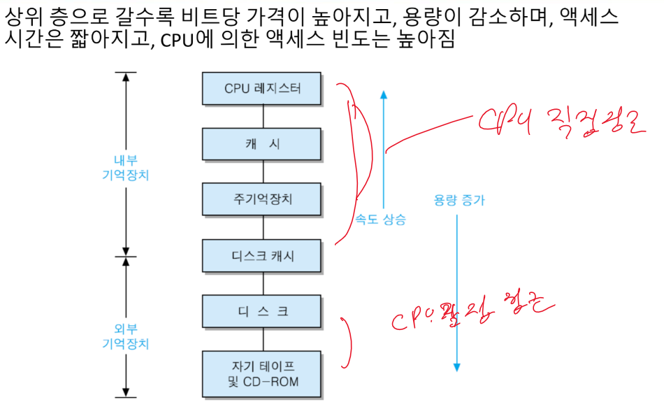

- ### 내부 기억장치

  - CPU가 직접액세스 할수 있는 기억장치들
  - CPU레지스터 ,캐시 기억장치,주기억장치 ,디스크 캐시

- ### 외부 기억장치

  - CPU의 직접액세스가 불가 하고, 장치 제어기를 통해서만 액세스 할수 있는 기억장치들
  - 디스크,CD-ROM

## 주 기억 장치의 이해

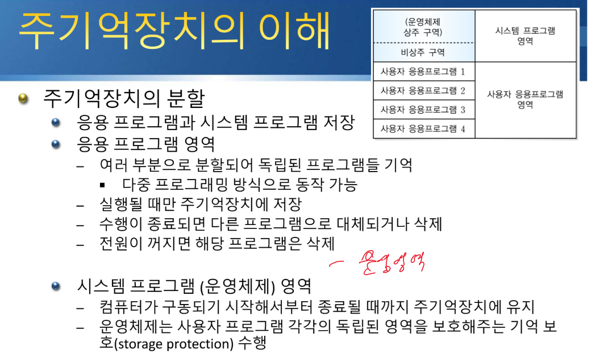

- ### 단일 사용자 할당 기법 --현재 사용 X

  - ##### 운영체제가 차지하는 부분을 제외한 나머지 기억 공간의 부분을 한 사용가가 독점 사용하도록 하는 기법

  - #### 장점

    - 사용자에게 융통성을 최대한 제공
    - 최대의 단순성과 최소의 비용을 만족
    - 특별한 하드웨어가 필요 없으며, 운영체제 소프트웨어도 필요 없음

  - #### 단점

    - 사용자가 사용하는 부분 이외의 부분은 낭비
    - 입력과 출력을 수행하는 동안 주 기억장치 내의 프로그램은 중앙처리장치를 계속 쓸 수 없기 때문에 유휴 상태가 되므로 활용도가 매우 낮음
    - 프로그램이 주기억장치의 용량보다 큰 경우 수행 불가

- ### 고정 분할 할당 기법

  - #### 각 프로그램에 고정된 동일 크기의 분할된 구역 할당

    - #### 장점 :

      - 프로그램이 적재되고 남은 공간에 다른 프로그램 적재 GKDU TNGOD
        - 프로세서와 기억장치 같은 자원의 활용도 크게 향상
        - 동시에 여러프로그램을 주기억 장치에 적재하여 수행하는 다중 프로그램 기법이 가능

    - #### 단점

      - 할당되는 저장 공간이 작고 저장될 프로그램이 클 경우에는 프로그램이 작은 단위로 쪼개 지는 단편화의 문제가 발생
      - 프로그램과 할당된 분할 구역의 크기가 일치 하지 않으면 프로그램이 점유하고 남은 공간 발생

- ### 가변 분할 할당 기법

  - ##### 가변 분할 할당 기법에서 주기억 장치를 검사, 빈영역을 하나의 빈영역으로 만드는 방법

    - 운영체제가 사용중인 블록을 한데 모으고 ,비어 있는 기억장소를 하나의 커다란 공백으로 처리

- ### 기억장소의 집약

  - #### 장점

    - 기억장소에 분산되었던 공간을 한 곳에 모음으로써 사용 가능한 큰 메모리 영역을 생성하며 기억장소의 낭비의 최소화

  - #### 단점

    - 기억자이를 집약하는동안 시스템은 지금까지 수행해오던 일들을 일단 중지해야하며 집약을 위해 많은 시간소모
    - 수행 중이던 프로그램과 데이터를 주기억 장치 내의 다른 장소로 이동시키키 때문에 각각의 위치 및 이에 관계되는 내용을 수정해야함

- ### 가변 분할 할당 기법에서 공백영역탐색 알고리즘

  - 최초 적합 방법
    - 여러 유휴 공간들을 차례대로 검색해 나가다가 새로운 프로그램을 저장 할 수있을 만큼의 크기를 가진 부분을 최초로 찾으면 그곳에 할당
  - 최적 적합 방법
    - 여러 공백 중 새로운 프로그램이 요구하는 크기보다 크면서 가장 크기가 비슷한 공간을 채택하여 할 당 
    - 매우 작은 공백만 생긴다는 장점
  - 최악 적합 방법
    - 존재하는 여러 공백 중 가장 큰 부분을 찾아 할당
    -  프로그램이 할당되고 남은 공간이 크다면, 그 나머지 부분을 다른 프로그램에 할당하여 사용가능

## 반도체 기억 장치

- RAM
- 특성 
  - 임의 액세스
  - 반도체 집적회로 기억장치
  - 데이터 읽기 ,쓰기 가능
  - 휘발성: 전원 공급 중단되면 내용이 지워짐

### 칩, 제어신호들

### 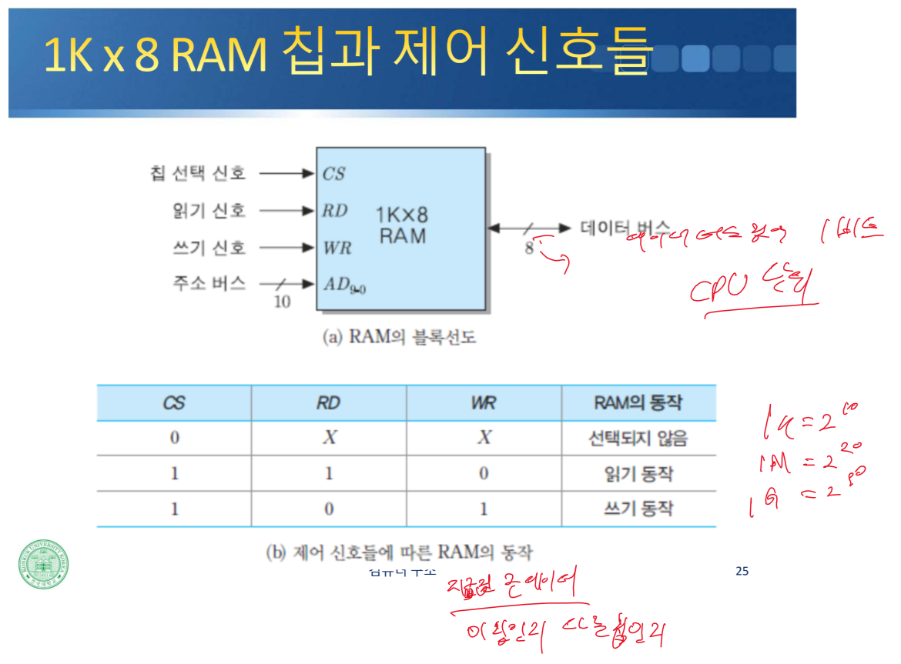

## RAM의 분류

#### 동적 RAM(DRAM,Dynamic RAM)

- ##### 캐패시터에 전하를 충전하는 방식으로 데이터 저장하는 기억 소자들로 구성

- ##### 전력소비가 적고 단일 메모리 칩내에 더 많은 정보 저장 가능 -집적 밀도가 높다

- ##### 데이터의 저장 상태를 유지하기 위하여 주기적인 재충전 필요 - 추가 재충전 필요

- ##### 같은 용량의 SRAM 보다 가격이 더 저렴

- ##### 용량이 큰 주기억 장치로 사용

- **트랜지스터는 스위치 역할을 한다. 주소 선에 전압을 적용하면 스위치는 닫힌다.**

- **읽기 연산의 경우에는 셀이 충전 정도를 감지하여 그 정도 에따라 0또는 1을 결정 이런 감지는 셀을 방전 시키므로 읽기 끝나기 전에 다시 재충전해주어야함**

#### 정적 RAM(SRAM, Static RAM)

- ##### 기억 소자로서 플립-플럽을 이용하여 기억장치 셀 구성 - 집적 밀도가 낮다.

- ##### 전력이 공급되는 동안에는 재충전 없이도 데이터를 계속 유지 가능

- ##### DRAM보다 다소 더 빠르다.

- ##### 높은 속도가 필요한 캐쉬 기억장치로 사용

#### 반도체 기억장치도 칩 형태로 제공

**한번에 일거나 쓸 비트의 수를 결정하는 것이 반도체 기억장치 설계에 있어 중요한 설계 쟁점중 하나**

#### B개의 비트로 이루어진 W개의 단어들 **WxB bit **로 표현

## RAM

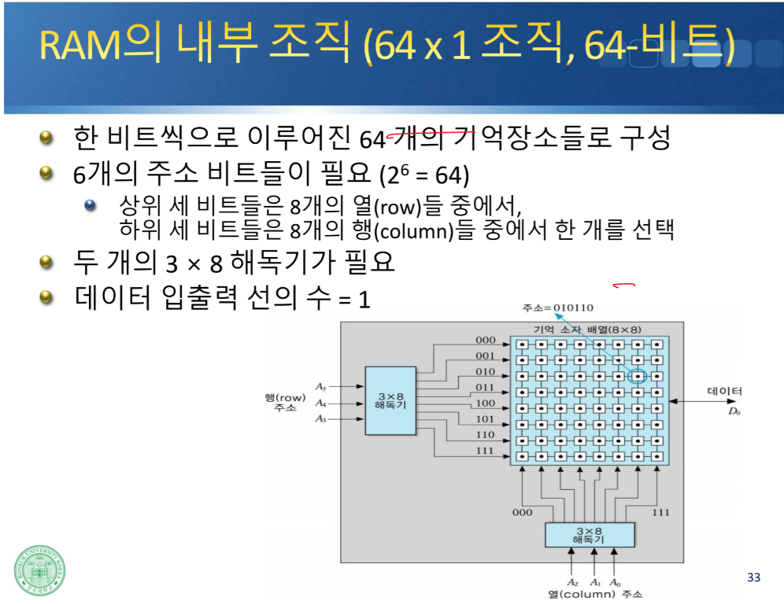

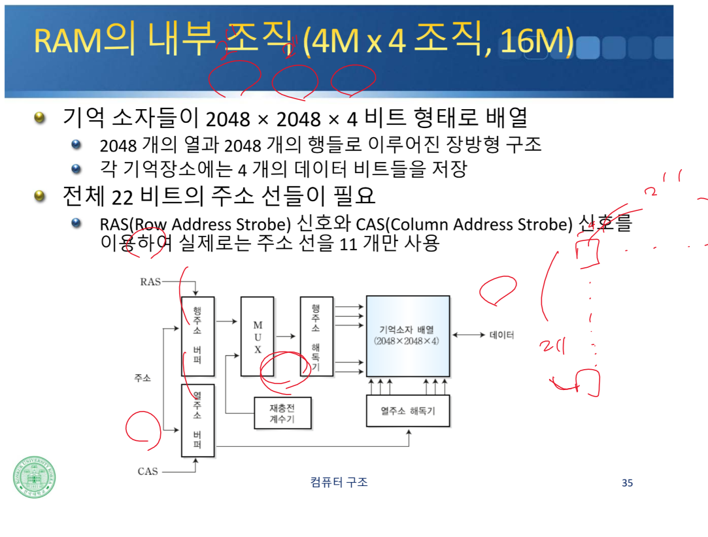

### 실제 주소선 11개만...

## 칩 패키징

- 칩 패키징은 신호의 입력과 출력을 위한 연결 핀들이 포함
  - 칩 패키징은 신호의 입력과 출력을 위한 연결 핀들이 포함
    - 기업장치 칩 패키징 내에 w개의 단어가 있다하면 주소핀의 개수는 log2 W로 정의 
    - 여기에 데이터 핀, 전원 공급핀,접지,칩선택 핀 등이 포함
  - 4Mx4bit DRAM의 패키징
    - 주소핀의 수-11개
    - 데이터 핀의 수 4개
    - Vcc, Vss,RAS,CAS,WE,OE

## 정리 문제

- #### 내부 기억장치와 외부 기억장치를 구분하는 기준이 되는 것은?

  - ##### CPU의 직접접근 가능 여부

- #### 어떤 기억장치의 액세스를 시작하는 순간부터 다음 액세스를 다시 시작할 수있을 때까지의 시간 간격을 나타내는 것은?

  - ##### 기억장치사이클 시간

- #### 계층적 기억장치 시스템에서 첫 번째 기억장치의 액세스 시간이 20ns이고 두 번째 기억장치의 액세스 시간은 200ns이다 첫 번째 계층 기억장치의 적중률이 80%라면, 평균 기억장치 액세스 시간은 얼마인가

  - ##### 20 x 0.8+200 x0.2=16+40= 56 , 56ns

- #### 16M x 4 비트 조직의 RAM 칩에는 주소핀이 몇개가 필요한가

  - ##### 12개 

## ROM

- #### 영구저장이 가능한 반도체 기억장치

- #### 읽는 것만 가능하고, 쓰는 것은 불가능

- #### 다름 내용들의 저장에 사용

  - 시스템 초기화 프로그램 및 진단 프로그램 서브루틴들
  - 빈번히 사용되는 함수 프로그램
  - 제어 유니트의 마이크로 프로그램

- ### 종류

  - PROM: ROM과 같지만 제조과정에서 데이터 기록하지 않고 나중에 전자적으로 기록-한번 쓰는 것이 가능

  - EPROM - 쓰기 연산을 수행하기전에 자외선이용 기존 데이터를 **전부**지우는 것이 가능한 PROM
    여버 번 쓰기 가능하나 데이터 삭제과정이 매우 느림

  - EEPROM

    - 전기적으로 지울수있는 EPROM
    - 데이터 갱신횟수 제한 -수만번정도

  - #### 플래시 기억장치(FLASH MEMORY)

    - EEPROM보다는 삭제시간이 빠르고 집적밀도도 높음
    - 삭제횟수 십만~백만
    - 하드디스크를 대체하는 SSD의 구성요소
    - NAND형 페이지 단위 읽기/쓰기 가능, 블록 단위(64/128페이지) 단위 삭제
    - NOR형 바이트 단위 읽기/쓰기 가능

## 기억장치 모듈의 설계

- #### 각 기억장치 칩의 입출력 비트수가 단어 길이보다 짧은 경우

  - 여러 개의 칩을 병렬로 접속하여 기억장치 모듈로 구성 -동일한 주소를 공유

- #### 필요한 기억장치 용량이 각 기억장치 칩의 용량보다 큰 경우

  - 여려 개의 칩을 직렬로 접속하여 기억장치 모듈을 구성-서로 주소의영역이 나뉨

## 정리 문제

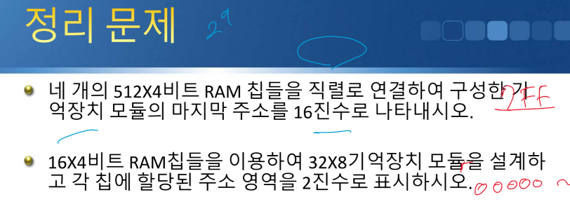

2^(9)*4-> 2^11 0~2^11

000 0000 0000

111 1111 1111

7FF

# CA-10 캐쉬 기억장치

## 캐쉬 기억장치

- 사용목적
  - CPU와 주기억장치 속도 차이로 인한 CPU 대기 시간을 최소화 시키기 위하여 CPU와 주기억장치 사이에 설치하는 고속 반도체 기억장치 -> 프로그램코드 데이터 인출과정 긴 시간기다림
- 특징 
  - 주기억 장치보다 액세스 속도가 높은 칩 사용
  - 가격 및 제한된 공간 때문에 용량이 작다

## 용어 정리

- #### 캐쉬 적중

  - CPU가 원하는 데이터가 이미 캐쉬에 있는 상태

- #### 캐쉬 미스 - CPU가 원하는 데이터가 캐쉬에 없는 상태

- #### 적중률 -캐쉬에 적중되는 정도  H= 캐쉬에 적중되는 횟수/전체 기억장치 액세스횟수

- #### 캐쉬의 미스율  - 1-적중률

- #### 평균 기억장치 액세스 시간: Ta

  - Ta = Hx Tc+ (1-H)x Tm  (Tc는 캐쉬 액세스 시간, Tm은 주기억장치 액세스 시간)

### 캐쉬적중률은 프로그램과 데이터의 지역성에 크게 의존

## 지역성

- ### 지역성

  - CPU가 주기억장치의 특정부분에 위치한 프로그램 코드나 데이터를 빈번히 혹은 집중적으로 액세스 하는 현상

- ### 시간적 지역성

  - 최근에 액세스 된 프로그램이나 데이터가 가까운 미래에 다시 액세스될 가능성이 높다.
  - 반복 루프, 서브루틴 호출, 공통 변수

- ### 공간적 지역성

  - 기억장치 내에 인접하여 저장되어 있는 데이터 들이 연속적으로 액세스 될 가능성이 높다.
  - 표 배열의 데이터 집중적 액세스 

- ### 순차적 지역성

  - 분기가 발생하지 않는 한 명령어들은 기억장치에 저자왼 순서대로 인출되어 실행
  - 순차:비순차 = 5:1
  - :smiley:공부하기 싫어요

## 캐쉬 설계의 공통적인 목표

- ### 캐쉬 적중률의 극대화 

- ### 캐쉬 액세스 시간의 최소화

- ### 캐쉬 실패에 따른 지연시간의 최소화

- ### 주기억장치와 캐쉬간의 데이터 일관성 유지 및 그에 따른 오버헤드 최소화

## 캐쉬의 크기/ 인출 방식

- 캐쉬의 크기 
  - 용량이 커질수록 적중률이 커지지만 비용이 증가
  - 용량이커질수록 해독정보 인출을 위한 주변회로가 더 복잡해지기 때문에 액세스 시간이 길어짐
- 인출 방식
  - 요구 인출 방식- 필요한 정보만인출
  - 선인출 방식
    - 필요한 정보외에 앞으로 필요할 것으로 예측되는 정보도 미리 인출- 블록단위 인출등
    - 지역성이 높을수록 효과
    - 블록의 크기는 2~4단어가 최적

## 주기억장치와 캐쉬의 조직

### 블록

- 주기억장치로 부터 동시에 인출되는정보들의 그룹
- 주기억장치의 용량 2^n단어
- 블록 =K단어 -> 블록의 수 2^n/K개

### 슬롯

캐쉬에서 한 블록이 저장되는 장소

### 태그

슬롯에 적재된 블록을 구분해주는 정보

## 사상방식

- #### 직접 사상

- #### 완전 연관 사상

- #### 세트-연관 사상->실제 사용

## 매핑 함수

캐시의 슬롯수가 주기억장치의 블록 수에 비해 상대적으로 적으므로 주기억장치 블록을 캐시슬롯에 매핑하는 알고리즘 필요

주기억장치의 어떤 블록들이 현재 캐시에 있는지 결정하는 방법도 필요

## 직접 사상

- 주기억장치의 블록들이 지정된 하나의 캐쉬 슬롯으로만 사상
- 매핑함수i= j mod m ,캐시슬롯의 번호= 주기억장치 블록번호 mod 캐쉬 슬롯의 전체수

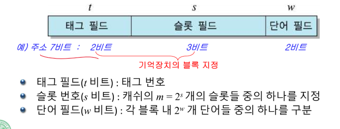

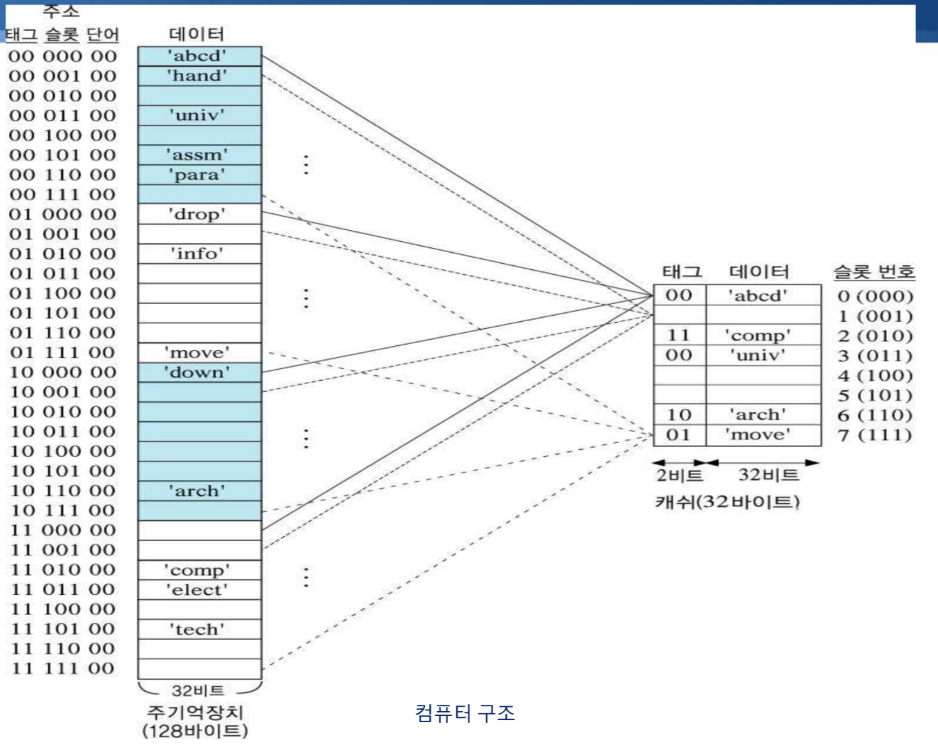

### 직접 사상 캐쉬의 장단점

- 장점 : 하드웨어가 간단하고, 구현하는 비용이 적게든다.
- 단점 : 주어진 주기억장치 블록이 저장되는 캐시의 위치가 고정, 같은 위치로 매핑되는 두블록을 자주 읽으면 계속 캐시 내용이 바뀌어야하는 문제점 발생

## 완전-연관 사상

- 직접 매핑과 달리 주 기억장치의 블록은 캐시의 아무 라인에 적재 가능
-  주소를 태그와 워드 필드로 나누어 사용
  - 따라서 주소내에 캐시 라인 번호를 결정하는 필드가 없음
- 캐시 내 블록이 있는지 검사하기위해 한 번에 모든 태그를 동시에 비교하여야하 함
- 태그 필드 = 주기억장치 블록 번호
- 기억장치 주소 형식 태그와 단어

#### 고려 사항

- 슬롯 번호에 따라 차례로 적재
- 만약 빈 슬롯 없이 캐쉬가 완전히 채워진 상태 일 때 새로운 블록이 인출->교체
- 교체
  - 가장 오래된 블록이 저장된 블록 선택
  - 최근에 액세스된 횟수가 가장 적은 슬롯 선택

### 장단점

- #### 장점

  - ##### 새로운 블록이 캐쉬로 적재 될 때 슬롯의 선택이 매우 자유로움

  - 지역성이 높다면 적중률이 매우 높아짐
    -성능은 교체 알고리즘에 따라

- #### 단점

  - ##### 캐쉬 슬롯들의 태그들을 병렬로 검사하기 위하여 매우 복잡하고 비용이 높은 회로 필요

## 세트-연관 사상

- #### 직접 사상과 연관 사상의 장점만을 취하는 절충안

- 캐쉬는 v개의 세트들로 나누어 지며 각 세트들은 k개의 슬롯들로 구성

  - 주 기억장치 블록 그룹이 하나의 캐쉬 세트를 공유
  - 각 캐쉬 세트에는 두 개이상의 슬롯들이 존재

- 세트당 슬롯의 수를 4이상 늘리면 성능 향상에 도움이 되지 않음ㄴㄴ

- 캐시 슬롱의 수 m과 주기억장치 블록이 적재될 수 있는 캐쉬 세트 번호i

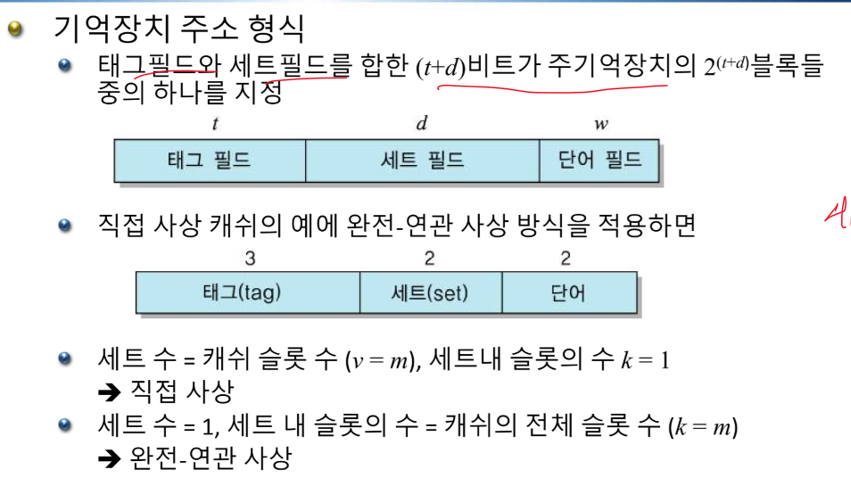

### 세트 연관사상의 동작원리

- 기억장치 주소의 세트 비트들을 이용하여 캐수 ㅣ세트들중의 하나를 선택
- 주소의 태그 필드 내용과 그 세트내의 태그들을 비교

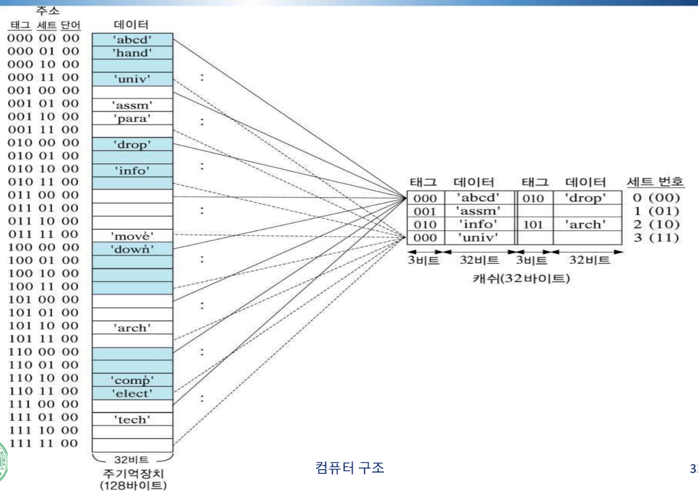

## 정리문제

- 주기억장치의 용량이 1MB이고 캐시의 용량은 16KB인 시스템에서 캐시라인의 크기는 4B이다 직접 사상 방식이 사용된다 주기억장치는 바이트 단위로 주소지정
  - 캐시에는 몇개의 라인 또는 슬롯들이 존재 - 2^14/2^2 -- > 2^12 라인 존재
  - 주기억장치의 블록수는 몇개 인가 -> 주기억 장치 블록 수 -->
  - 한 라인을 공유하는 주기억장치 블록들의 개수는 얼마인가?
  - 주소형식과 각 필드의 비트 수를 결정하시오.
- 세트 연관 캐시가 64개의 라인을 가지고 있으며, 각 세트는 4개의 라인들로 구성된다. 주기억장치는 4096개의 블록들을 가지고 있으며 각 블록은 16바이트로 구성된다. 주기억장치 주소의 형식 ㅁ치 필드 별 비트수를 결정하시오.

## 교체 알고리즘

- 새로운 블록을 캐시로 가지고 왔을 때 빈 슬롯이 없으면 기존 슬롯 중 하나와 교체되어야함
- 직접 매핑의 경우 교체할 라인이 정해져 있으므로 별도의 교체 알고리즘이 필요 없지만, 완전 연관매핑 또는 세트연관매핑의 경우에는 교체 알고리즘이 필요
- 교체 알고리즘
  - LRU알고리즘
    - 사용되지 않은채로 가장 오래 있었던 블록을 교체하는 방식
  - FIFO알고리즘
    - 캐쉬에 적재된 지 가장 오래된 블록을 교체하는 방식
  - LFU알고리즘
    - 참조된 횟수가  가장 적은 블록을 교체하는 방식
  - 임의방식
    - 임의로 슬롯을 선택하는 방식

## LRU 교체 알고리즘

- 오랜 기간 참조되지 않은 블록이라면 가까운 장래에도 역시 사용되지 않을 것
- 2-WAY방식 각슬롯마다USE 사용되면 1설정 다른슬롯 0설정
- 4-WAY 집합 연관 방식에서 카운터를 이용한LRU구현 방법
  - 각슬롯 마다 2비트의 카운터를 연결
  - 접근이 이루어지면 그 슬롯의카운터는 0으로 설정하고 그 슬롯이 카운트가 원래보다 적은경우 나머지 슬롯의 카운터를 하나증가
  - 집합에 있는 모든 라인에 블록이 적재 되어 있을 때 블록 교체가 필요하면 카운터 값이 3인 것을 교체

## FIFO 교체알고리즘

- 가장 먼저 들어온 블럭을 교체시키는 방법
- 순환 버퍼(QUEUE)를 사용하여 구현
  - 캐시 자체를 순환 버퍼로 구성
- 장단점
  - 장점
    - 이해하기 쉽고 설계가 간단
  - 단점
    - 중요한 블록이 오랫동안 있었다는 이유만으로 교체되는 불합리
      - 가장 오래 있었던 블록은 앞으로 계속 사용될 가능성이 있기때문

## LFU교체 알고리즘

- 사용 빈도가 가장 적은 블록 즉, 호출된 횟수가 가장 적은 블록을 교체하는 방법
- 각 슬롯에 카운터 설치하여 구현
- 빈도수가 같은 경우는 FIFO방식과 동일
- 단점 바로 불러온 블록이 교체될수있음
  - 가장 드물게 이용되는 블록이 가장 최근에 옮겨진 블록일 가능성이 있음
- 

## 임의 교체 방식

## 쓰기 정책

- 쓰기 정책
  - 캐쉬에 적재되어 있는 데이터가 수정되었을 때, 그 내용을 주기억 장치에 갱신하는 시기와 방법을 결정 하는 것
- 쓰기 정책의 필요성
  - 캐시에 있는 어떤블록의내용이 변경되었지만 주기억 장치에는 아직 변경이 반영되지않을 가능성
- 쓰기 정책의 고려사항
  - 여러 장치가 주억장치에 직접쓰기와 읽기 가능
  - 여러 프로세서가 같은 버스에 연결된 다중 프로세서 시스템에서는 각 프로세서는 각자의 캐시를 가지고 있을 수있음

## 쓰기 정책의 종류

### Write thorough

- 모든 쓰기는 주기억장치와 캐시에 반영
- 다른 장치는 시스 템버스를 관찰 하여 스스로 사용하는 캐시를 갱신
- 장점 항상 일관성
- 단점 : 트래픽이 많이 발생, 쓰기 동작에 걸리는 시간이 김

### Write back

- 캐시에만 우선 반영되고, 각 캐시의 슬롯마다 UPDATE 비트를 설정
- 주 기억장치에 대란 쓰기는 슬롯이 교체될 때 수행
- 장점 : 트래픽이 적게 발생
- 단점 : 다른 장치는 항상 캐시를 통해 데이터를 접근해야함 - 캐쉬회로가 복잡

## 다중 프로세서 시스템에서의 데이터 불일치

다수의 프로세서 들이하나의 시스템버스에 접속

각프로세서가 별도의 캐쉬 운영

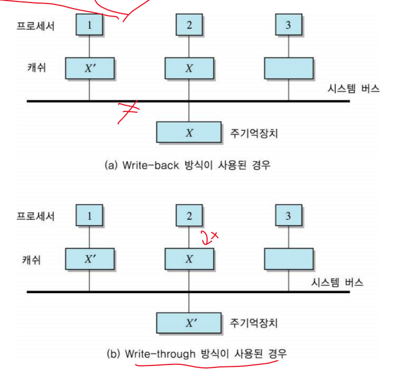

### 모두 문제점 발생

- 다중 프로세서 시스템에서 각 프로세서가 각자의 캐시를 가지고 있는 경우
- WriteThrough+ 버스 감시
- 하드웨어 투명성
  - 별도의 하드웨어 사용하여 하나의 캐시에대한 갱신이 주기억 장치 뿐만 아니라 다른 모든 캐시 에도 반영
- 캐시 불가능 기억장치
  - 주기억장치의 일부분만 모든 프로세서가 공유하도록 하고, 이 부분은 캐시화 할수없도록 하는 방식

## 계층적 캐쉬

- #### 온 칩 캐쉬

  - CPU칩 내에 내장된 캐쉬
  - 외부 버스 트래픽을 줄여주머, 칩 내에 있으므로 성능 향상에도 도움

- #### 계층적 캐쉬

  - 온칩 캐쉬를 1차 캐쉬로 사용하고 외부에 더 큰용량의 2차 캐쉬(온 오프칩 캐쉬)를 설치
  - L2는 L1의 슈퍼 세트
    - L2의 용량이 L1보다 크며, L1의모든 L2에도 존재
  - 먼저 L1을 검사하고, 만약 원하는 정보가 L1에 없다며 L2를 검사하며ㅡ L2에도 없는 경우에만 주기억장치 액세스

- #### 오프칩캐쉬를 사용하는 이유

  - L1 cache만 사용 하였을 때 데이터가 L1에 없으면 직접시스템 버스를 통해 주기억장치로 부터 데이터를 인출하야함
  - 보통 주 기억장치는 DRAM을 사용하지만 오프칩 캐쉬는 보다 빠른 SRAM을 사용
  - 또한 오프칩 캐쉬와 통신은 시스템 버스를 사용하지 않고 별도의 빠른 전용 버스를 사용

- #### 2단계 캐쉬 시스템의 평균 기억 장치 액세스 시간

  - Ta= H1xTc1+(H2-H1)x Tc2 +(1- H2)x Tm

### 통합 캐쉬

단일 캐쉬에 데이터와 명령어를 모두 저장한 캐쉬

### 분리 캐쉬

- 데이터용 캐쉬와 명령어용 캐쉬를 분리하여 사용
- 명령어 실행 파이프 라인에서 명령어 인출 단계와 오퍼랜드 인출 단계 간의 캐쉬 액세스 충돌 현상 제거
- 대부분의 고속 프로세서들 에서사용

## 정리문제

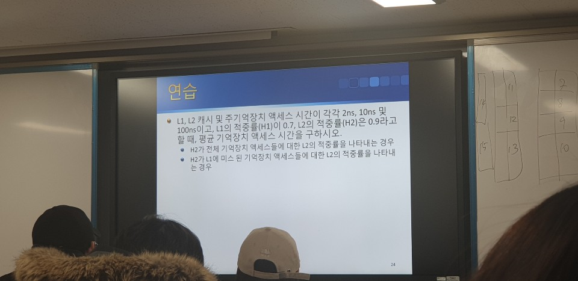

# CA-11

## 자기 디스크

- 자화될 수있는 물질로 코팅된 플라스틱이나 금속 유리를이용한 원형 평판으로 만들어진 저장 장치
  - 하드 디스크, 혹은 디스크
- 주요 구성 요소들
  - 원형 평판
    - 실제 정보가 저장되는 장소로서 다수의 트랙들로 구성
  - 헤드
    - 전도성 코일을 통하여 표면을 자화시킴으로 써 데이터를 저장하는 장치
  - 디스크 팔
    - 헤드를 이동시키는 장치
  - 구동장치
    - 디스크 팔을 움직이는 모터
- 헤드의 수에 따른 디스크의 분류
  - 단일 헤드 디스크
  - 다중헤드 디스크
- 헤드의 이동성에 따른 분류
  - 이동-헤드 디스크
    - 단일 헤드 디스크 : 헤드를 이동시키면서 디스크 표면의 데이터를액세스
    - 다중 헤드 디스크 : 헤드 이동거리가 단축
  - 고정-헤드 디스크
    - 각 트랙당 헤드를 한개 씩 설치
    - 탐색시간= 0
    - [단점] 제작비용이 높아짐

## 디스크의 구조

- ### 트랙 -디스크는 트랙 동심원으로이루어지며, 각 트랙 폭은 같다

- ### 트랙간 갭 -헤드가 잘못 정렬되거나 자장의 간섭 때문에 발생하는 오류 방지위한 트랙 사이의 간격

- ### 섹터

  - 디스크에 한번에 쓰거나 읽는 데이터 크기의 최소단위
  - 대부분 512바이트

- ### 섹터간 갭

  - 섹터들을 구분하기 위한 간격

- 표면 당 트랙의 수 500~2000개

- 트랙당 섹터의 수 32개

## 등각 속도

- 디스크가 일정한 속도로 회전하는 상태에서 트랙의 위치에 상관 없이 데이터를 동일한 비율로 액세스 하는 방식
- 등각 속도 방법
- 트랙의 길이 바깥쪽 -> 길어짐
- 장점: 데이터 읽기 쓰기 장치가 간단
- 단점 : 저장 공간 낭비(저장 밀도 차이)
  - 바깥쪽 트랙이 안쪽 트랙보다 더 길지만
  - 저장하는 데이터 양은 같음

## 등선 속도

- 전체 공간을 1개의 나선형 트랙
- 바깥쪽 트랙으로 갈수록 저장되는 비트 수가 증가
- 읽기/ 쓰기 장치 설계가 복잡하고 모터가 가변적으로 구동

## 디스크 형식화 작업

- ##### 디스크의 구성을 검사하고 그에 관한 정보와 트랙의 시작점, 섹터의 시작과 끝을 구분하기 위한 제어 정보등을 디스크상의 특정 위치에 저장하는 과정

- 트랙 형식의 예

  - 섹터 크기 =600바이트(512 바이트 데이터+ 제어 정보)
  - 제어정보(ID필드): 섹터를 구분하는데 필요한 식별자 또는 주소 제어정보
  - SYNCH바이트 트랙번호, 헤드번호,섹터 번호ㅡ오류검출코드

## 디스크 드라이브

- 디스크 헤드가 부착된 디스크 팔, 구동장치, 디스크를 회전 시키는 축, 데이터전송에 필요한 전자회로 등을 포함한 전체 패키지
- 디스크 이동성에 따른 분류
  - 제거 불가능 디스크
    - 디스크 드라이브 내에 고정시킨 디스크
  - 제거 가능 디스크
    - 디스크 드라이브로부터  꺼낼수 있으며, 다른 디스크 드라이브에 삽입시켜 데이터를 읽거나 쓸 수있는 디스크
- 디스크 면수 에 따른 분류
  - 양면 디스크, 단면 디스크
- 실린더 
  - 서로 다른 디스크 표면에 있지만 같은 반경에 위치하고 있어서, 디스크 팔을 움직이지 않고도동시에 액세스 할 수있는 트랙들의 집합

## 디스크 액세스 시간

- 디스크 읽기/쓰기 동작 순서

  - 헤드를 해당 트랙으로 이동
  - 원하는 섹터가 헤드 아래 회전되어 올 때까지 대기
  - 데이터를 전송

- 디스크 액세스 시간

  - 디스크액세스 시간=탐색시간+회전지연시간+데이터전송시간

- 탐색 시간

  - 트랙을찾는 시간 
    - 이시간은 측정하기가 쉽지 않음
    - 디스크의 평판은 직경 3.5인치
    - 직경이 작을수록 탐색시간은 짧음
    - 보통평균 탐색 시간은 10ms미만

- 회전 지연

  - 섹터를 찾는 시간
  - 가장 많이 사용되는 하드 디스크의 회전속도
    - 한번 회전하는데 대략 8ms가 소요
    - 따라서 평균 회전 지연 시간 (확률적으로 반 바퀴)=4ms
  - 참고) 7200RMP이므로 120r/sec
    - -따라서 1/120= 0.0083sec = 8ms

- ### 전송시간

  - 섹터에서 데이터를 읽어내어 I/O버스로 데이터를 전송하기 전에 디스크 버퍼에 저장하기 까지의 시간
  - 전송시간은 회전속도에 의존
    - 블록의 크기, 트랙의 저장 밀도, 버스 전송률 및 제어기 내부 전자회로 속도 등
  - T = b/(rN)
    - T전송시간
    - b:전송할 바이트의수
    - N : 트랙에 있는 바이트의 수
    - r : 회전속도 (1초당 회전수)

## RAID

- 프로세스 속도와 디스크 속도 매우 불균형
  - 프로세스의 속도가 더 빨라지더라도 전체 시스템의 성능향상은 디스크 I/O속도에 의해 제한됨
- 컴퓨터 성능 = 프로 세스와 디스크 속도
  - 반도체 기억장치와 달리 디스크는 기계적 장치 들이 많이 포함되어 반도체 기술이 전자회로의 발전 속도에 비해 현저히 느림
  - 30년간 - CPU 주기억 장치 속도 수백배 증가
    - 디스크액세스 시간 수십배 정도 증가
  - 디스크 성능의 개선이 절실히 요구

## 디스크 인터리빙

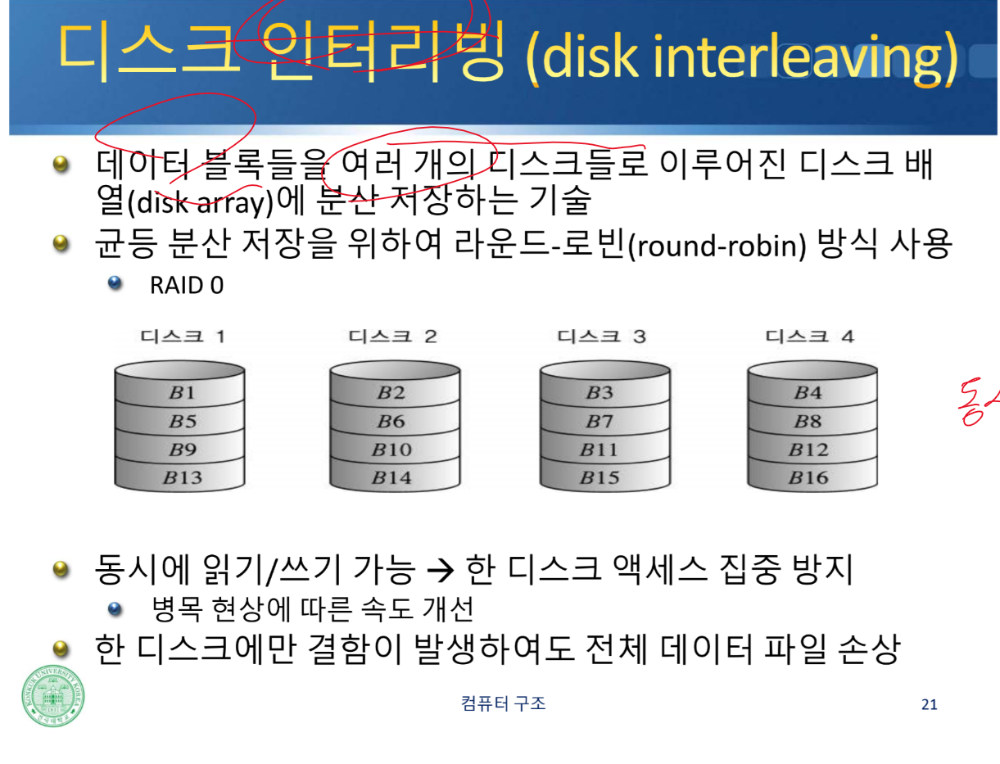

## 디스크 배열의 단점

- 디스크 배열의 주요 단점

  - MTTF의 저하

  MTTF =단일 디스크의 MTTF / 배열 내 디스크들의 수

## RAID-2

- 검사 디스크들의 수
  - G : 데이터 디스크의 수
  - C : 필요한 검사 디스크들의 수
       2^c -1>= G + C

## 헤밍 코드

- 미국의 Bell 연구소의 R.W.Hamming에 의해서 개발

- 7개의 비트로 구성되어 있으며, 코드 중에서 1비트의 에러를 검출, 교정

  - 3,5,6,7 비트 4개의 BCD코드
    - 8421코드로 가중값을 가짐
  - 1,2,4 번째 비트 : 패리티 비트
  - 패리티 비트들은 다음과 같이 짝수 패리티로 구성
    - P1 : 1,3, 5, 7 번째 비트들과 짝수 패리티
    - P2 : 2,3,6,7 번째 비트들과 짝수 패리티
    - P3 : 4,5,6,7 번째 비트들과 짝수 패리티
  - 3개의 여분의 비트(P1,P2,P3)를 추가하여 에러를 찾아서 교정

  #### 패리티 비트 자기 자신 비트 말고 나머지 3개 짝수인지 홀수인지

## RAID-3

패리티 디스크 방식을 이용한 오류 검출 및 정정 방식 사용

​	많은 수의 검사 비트들을 사용해야함으로 낭비가 심함

